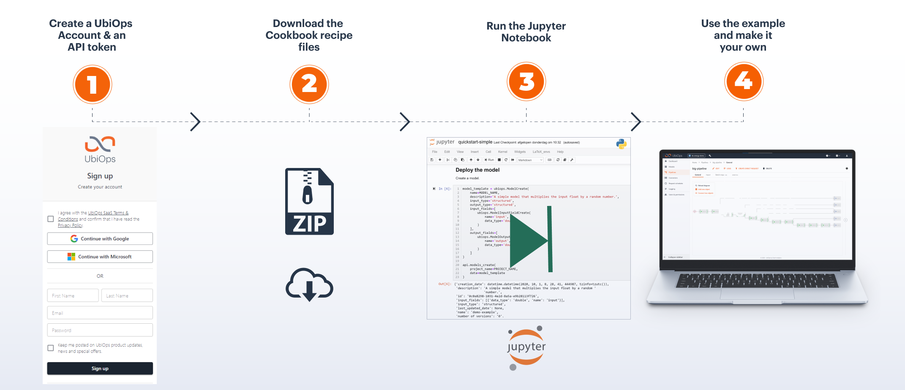

# Cookbook

Welcome to the UbiOps cookbook!

We released the UbiOps cookbook to provide (new) users with inspiration on how to work with UbiOps. 
Use it to find inspiration or to discover new ways of
working with the UbiOps platform. The examples range from full on use case examples to integrations and practical
implementation. The cookbook will be filled with more recipes in the future.

With only a (free) UbiOps account you can use the cookbook to have example applications running in your own environment 
in minutes.*

## How does it work?

Every *recipe* contains a standalone example with all the material you need to run it. They are all centered around 
a Jupyter Notebook. If you download the recipe folder and run the notebook it will build the example in your own 
UbiOps account. And the steps in the notebook explain how it's all done.

## Requirements

To be able to use the UbiOps cookbook you need three things:

- You need to have the UbiOps client library installed. This can be done via pip install or via Setuptools. For more 
information see our <a href="https://github.com/UbiOps/client-library-python" target="_blank">the GitHub page</a>.
- You need to be able to run Jupyter Notebook. See the <a href="https://jupyter.org/install" target="_blank">installation guide</a> 
  for more information.
- You need to have a UbiOps account. You can create a free account <a href="https://app.ubiops.com/sign-up" target="_blank">here</a>.

## The current recipes

| Topic and link to recipe                                                                                                  |
|---------------------------------------------------------------------------------------------------------------------------|
| [Creating a training and production pipeline with Scikit Learn in UbiOps](scikit-deployment/README.md)                    | 
| [Triggering a deployment/pipeline request from Google Cloud Functions](google-cloud-functions-triggered-request/README.md)|
| [Using blobs as temporary storage](blobs-temporary-storage/README.md)                                                     |
| [Azure Data Factory and UbiOps pipeline interaction tutorial](azure-data-factory/README.md)                               |
| [Pipeline that matches, orders and visualises a list of Pokemon](pokemonpipeline/Readme.md)                               |
| [Scheduled pipeline that classifies Amazon reviews](amazon-review-pipeline/README.md)                                     |

*It might be that you will need to make some space in your existing environment to run the examples though to stay 
within the limits.

## How to work with the recipes?

**Step 1:** Login to your UbiOps account at <a href="https://app.ubiops.com" target="_blank">https://app.ubiops.com/</a> 
and create an API token with project editor
admin rights. To do so, click on *Users & permissions* in the navigation panel, and then click on *API tokens*.
Click on *create token* to create a new token.

Give your new token a name, save the token in safe place and assign the 'project-editor' role to the token.
The role can be assigned on project level.

**Step 2:** Download the recipe folder and open the `.ipynb` notebook file. In the notebook you will find a space
to enter your API token and the name of your project in UbiOps. Paste the saved API token in the notebook in the indicated spot
and enter the name of the project in your UbiOps environment. This project name can be found in the top of your screen in the
WebApp. In the image in step 1 the project name is *scikit-example*.

**Step 3:** Run the Jupyter notebook and everything will be automatically deployed to your UbiOps environment! 
Afterwards you can explore the code in the notebook or explore the application in the WebApp.