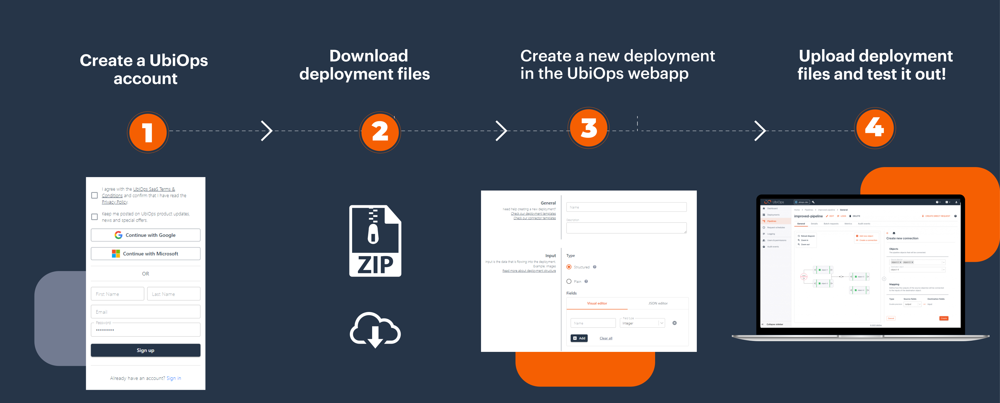

# Cookbook

Welcome to the UbiOps cookbook!

The UbiOps cookbook is here to provide (new) users with inspiration on how to work with UbiOps. Use it to find
inspiration or to discover new ways of working with the UbiOps platform.

With a (free) UbiOps account you can use the cookbook to have example applications running in your own environment
in minutes.*

## How does it work?

We have two categories in the cookbook,
**recipes** and **ready deployments**. Recipes contain full walkthroughs in jupyter notebooks, and ready deployments
contain ready-to-go deployment packages which illustrate how to use the deployment package for typical cases.

### Ready deployments

The ready deployments show how to set up your deployment package for typical use cases. You can download the
deployment package, fill in the deployment creation form in the UI, and upload the deployment package. Afterwards
you can make a request to the deployment to test it out.

### Recipes

Every *recipe* contains a standalone example with all the material you need to run it. They are all centered around
a Jupyter Notebook. If you download the recipe folder and run the notebook it will build the example in your own
UbiOps account.

## The current recipes

| Topic and link to recipe                                                                                                  | Functionalities of UbiOps addressed |
|---------------------------------------------------------------------------------------------------------------------------| ------------------------------------|
| [Creating a training and production pipeline with Scikit Learn in UbiOps](scikit-deployment/README.md)                    | Deployments, pipelines              |
| [Deploying a TensorFlow model in UbiOps](tensorflow-example/README.md)                                                    | Deployments                         |
| [Deploying an XGBoost model in UbiOps](xgboost-deployment/README.md)                                                      | Deployments                         |
| [Triggering a deployment/pipeline request from Azure Functions](azure-functions-triggered-request/README.md)              | Different forms of requests, integration |
| [Triggering a deployment/pipeline request from Google Cloud Functions](google-cloud-functions-triggered-request/README.md)| Different forms of requests, integration |
| [Using blobs as temporary storage](blobs-temporary-storage/README.md)                                                     | Blobs                               |
| [Azure Data Factory and UbiOps pipeline interaction tutorial](azure-data-factory/README.md)                               | Integration, pipelines              |
| [Using Azure ML services to train a model and deploy on UbiOps](azure-machine-learning/README.md)                         | Integration, deployments            |
| [Pipeline that matches, orders and visualises a list of Pokemon](pokemon-pipeline/README.md)                              | Pipelines                           |
| [Scheduled pipeline that classifies Amazon reviews](amazon-review-pipeline/README.md)                                     | Request schedules, pipelines        |
| [Deploying a recommender model using Apriori in UbiOps](recommender-system/README.md)                                     | Deployments                         |
| [Integration with MLflow model tuning tool](mlflow-example/README.md)                                                     | Deployments                         |
| [Integration with snowflake cloud-based data-warehouse](snowflake/README.md)                                              | Integration, deployments                         |
| [Integration with YData for imbalanced datasets](ydata-synthetic-data-fraud-detection/README.md)                                              | Integration, deployments, blobs                         |

## Requirements

To be able to use the UbiOps cookbook you need three things:

- You need to have the UbiOps client library installed. This can be done via pip install or via Setuptools. For more
information see our <a href="https://github.com/UbiOps/client-library-python" target="_blank">GitHub page</a>.

- You need to be able to run Jupyter Notebook. See the <a href="https://jupyter.org/install" target="_blank">installation guide</a>
  for more information.

- You need to have a UbiOps account. You can create a free account <a href="https://app.ubiops.com/sign-up" target="_blank">here</a>.

*You might need to make some space in your project by deleting deployment versions if you want to run all the examples and stay
within the limits of your account.
