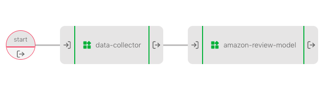

# Amazon review and UbiOps

_Download link for necessary files_: [Amazon review pipeline files](https://download-github.ubiops.com/#!/home?url=https://github.com/UbiOps/cookbook/tree/master/amazon-review-pipeline/amazon-review-pipeline)

In this example we will show you the following:

- How to deploy a pipeline that selects data and sends it to the model for prediction to UbiOps within seconds

- How to easily trigger the pipeline everyday and output the results

For this example we will use a model trained on (parts of) the amazon review dataset as taken from https://nijianmo.github.io/amazon/index.html*. The model takes in a written review of a product and outputs a classification of whether the review will be positive (1) or negative (0). This model can be used to automatically monitor the reviews of certain products. With using UbiOps, we can deploy a pipeline that is triggered every day that predicts and monitors the review score of products. If the score drops below a certain threshold, a signal is send, indicating that there may be something wrong with the product. This mechanism can of course be extended to other use cases involving textual (sentiment) analysis.

*Justifying recommendations using distantly-labeled reviews and fined-grained aspects Jianmo Ni, Jiacheng Li, Julian McAuley Empirical Methods in Natural Language Processing (EMNLP), 2019

## The Amazon review pipeline

The pipeline collects reviews from one day and feeds it to a model that predicts the review scores and gives a signal when the review scores are below a certain threshold.
It is made up of the following deployments:

| Model | Function |
|-------|----------|
| data-collector | Collects reviews of all products of a certain (given) day |
| amazon-review-model | Predicts review scores and compares them to a threshold value |

The pipeline looks like this:

## How does it work?

**Step 1:** Login to your UbiOps account at https://app.ubiops.com/ and create an API token with project editor 
rights. To do so, click on *Users & permissions* in the navigation panel, and then click on *API tokens*.
Click on *create token* to create a new token.

Give your new token a name, save the token in safe place and assign the 'project-editor' role to the token.
The role can be assigned on project level.

**Step 2:** Download the [amazon-review-pipeline](https://download-github.ubiops.com/#!/home?url=https://github.com/UbiOps/cookbook/tree/master/amazon-review-pipeline/amazon-review-pipeline) folder and open `amazon_review.ipynb`. In the notebook you will find a space
to enter your API token and the name of your project in UbiOps. Paste the saved API token in the notebook in the indicated spot
and enter the name of the project in your UbiOps environment. This project name can be found at the top of your screen in the
WebApp. In the image in step 1 the project name is *scikit-example*.

**Step 3:** Run the Jupyter notebook `amazon_review.ipynb` and everything will be automatically deployed to your UbiOps environment! 
Afterwards you can explore the code in the notebook or explore the application in the WebApp.
