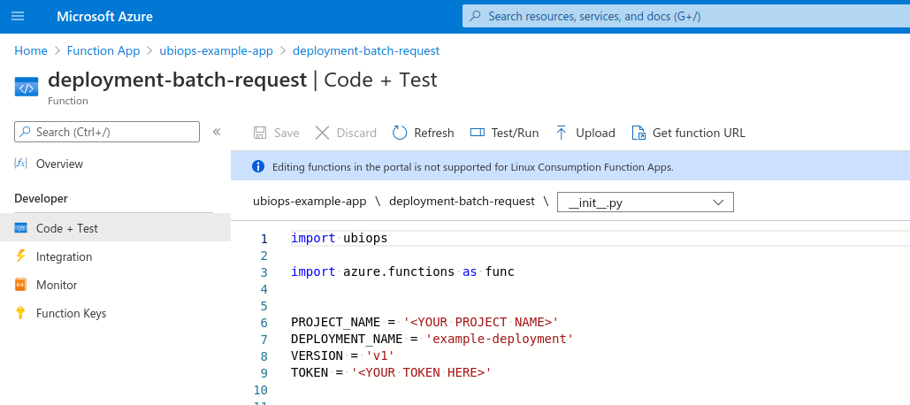

# Azure Functions Triggered Request

_Download link for necessary files_: [Azure Functions Triggered Request example files](https://download-github.ubiops.com/#!/home?url=https://github.com/UbiOps/cookbook/tree/master/azure-functions-triggered-request/azure-functions-triggered-request)

In this example we will show you the following:

- How to create a deployment and pipeline in the UbiOps platform

- How to deploy Azure Functions which trigger deployment and pipeline requests


## How does it work?

**Step 1:** Login to your UbiOps account at https://app.ubiops.com/ and create an API token with project editor
admin rights. To do so, click on *Users & permissions* in the navigation panel, and then click on *API tokens*.
Click on *create token* to create a new token.


Give your new token a name, save the token in a safe place and assign the following roles to the token: project editor and blob admin.
These roles can be assigned on project level.

**Step 2:** Download the [azure-functions-triggered-request](https://download-github.ubiops.com/#!/home?url=https://github.com/UbiOps/cookbook/tree/master/azure-functions-triggered-request/azure-functions-triggered-request) folder and open *dummy_deployment_pipeline_creation.ipynb* in the *azure-functions-triggered-request* folder. In the notebook you will find a space
to enter your API token and the name of your project in UbiOps. Paste the saved API token in the notebook in the indicated spot
and enter the name of the project in your UbiOps environment. This project name can be found in the top of your screen in the
WebApp. In the image in step 1 the project name is *scikit-example*. Run the Jupyter notebook *dummy_deployment_pipeline_creation.ipynb* and the deployment and/or pipeline will be automatically deployed to your UbiOps environment!


**Step 3:** At this point in the tutorial you should have a deployment and/or pipeline to use. 

We will now trigger requests to this deployment or pipeline by means of an Azure Function. Whether you are trying to trigger a deployment or pipeline request, this request can be either a regular request or a batch request. Thus, depending on what you want to trigger, you have in total 4 possibilities, where each of these possibilities has a different Azure Function that triggers the request:

- **Regular deployment request:** The corresponding Azure Function can be retrieved by downloading the [*deployment-request*](https://github.com/UbiOps/cookbook/tree/master/docs/azure-functions-triggered-request/azure-functions-triggered-request/functions/deployment-request) folder.

- **Deployment batch request:** The corresponding Azure Function can be retrieved by downloading the [*deployment-batch-request*](https://github.com/UbiOps/cookbook/tree/master/docs/azure-functions-triggered-request/azure-functions-triggered-request/functions/deployment-batch-request) folder.

- **Regular pipeline request:** The corresponding Azure Function can be retrieved by downloading the [*pipeline-request*](https://github.com/UbiOps/cookbook/tree/master/docs/azure-functions-triggered-request/azure-functions-triggered-request/functions/pipeline-request) folder.

- **Pipeline batch request:** The corresponding Azure Function can be retrieved by downloading the [*pipeline-batch-request*](https://github.com/UbiOps/cookbook/tree/master/docs/azure-functions-triggered-request/azure-functions-triggered-request/functions/pipeline-batch-request) folder.

Each of the listed folders follows the same structure. It consists of:

- a folder having the same name as the main folder, having:

  - an **\__init\__.py** file containing the function's code
  
  - a **function.json** file which defines the function's trigger, bindings and other configuration settings. The functions that we will use will be HTTP triggered, using POST method requests.

- a **requirements.txt** file where the dependencies needed for running the function are listed

- a **.gitignore** file for Azure Functions specific files that need to be omitted

- a **host.json** metadata file which contains global configuration options that affect all functions for a function app


Choose the type of request that you want to trigger and download the folder corresponding to that type of request.

**Step 4:**

**WARNING**

In this cookbook, we ask you to provide the API token hardcoded in the function's *\__init\__.py* file, for simplicity sake. We would like to warn the user that this should *absolutely never* be done in a production environment. 
The API token gives access to many functionalities in your UbiOps environment and should therefore be kept safe. Instead, you could make use of **Azure Key Vault**. You can find more information about the Key Vault [here](https://docs.microsoft.com/en-us/azure/key-vault/general/overview).


##### Functions triggering deployments
For functions triggering deployment requests, make sure to change the following things in the corresponding function in *\__init\__.py*:

-  Fill in the Authorization API Key.  
```
TOKEN = '<YOUR TOKEN HERE>'
```

-  Fill in the *PROJECT_NAME* to the name of the project you are using. 

```
PROJECT_NAME = '<YOUR PROJECT NAME>'
```

-  Fill in the *DEPLOYMENT_NAME* and *VERSION* to the name of the deployment and it's version you are using.
Keep the default values, unless you have given the deployment & version a specific name. 

```
DEPLOYMENT_NAME = 'example-deployment'
VERSION = 'v1'
```

##### Functions triggering pipelines

For functions triggering pipeline requests, make sure to change the following things in the corresponding function in \__init\__.py:

-  Fill in the Authorization API Key.  
```
TOKEN = '<YOUR TOKEN HERE>'
```

-  Fill in the *PROJECT_NAME* to the name of the project you are using. 

```
PROJECT_NAME = '<YOUR PROJECT NAME>'
```

-  Fill in the *PIPELINE_NAME* to the name of the pipeline you are using.
Keep the default values, unless you have given the pipeline a specific name. 

```
PIPELINE_NAME = 'example-pipeline'
```


**Step 5:** In the next step, you will need an Azure Function App set up. If you do not already have such an app, you can follow the steps 
described in [this](https://docs.microsoft.com/en-us/azure/azure-functions/functions-create-function-app-portal) tutorial to set one up.


Once the Azure Function App is ready, you can go ahead and deploy this Azure Function. Using the CLI, you can deploy this function using the command
```func azure functionapp publish <YOUR AZURE FUNCTION APP NAME>```. 
**Important**: make sure you are in the main folder of the function while executing this command.

**Step 6:** The Azure Function is now deployed! In this step, we are going to test it.

The function that you have deployed is triggered by an HTTP POST request. In the body of this request, a JSON string corresponding to the input of the UbiOps deployment/pipeline will be given.
In the case of our dummy deployment/pipeline, there is only one input field named *input* of type string.

To trigger the function that you have deployed, we will make a POST request to the function's URL endpoint using curl. To get the URL of the function, go to the function's page in the Azure Portal. Click on **Code + Test** in the left menu and then click on **Get function URL**. The function's page is depicted in the figure below. 



Now, using the curl command below, trigger a request to the deployed function. Make sure to change *\<YOUR FUNCTION URL\>* in the command with the actual URL of the function.
```
curl --header "Content-Type: application/json" --request POST --data "{\"input\": \"This is a test string\"}" <YOUR FUNCTION URL>
```

In case of a successful triggered deployment request, the output of the curl command should be the following:
```
Response of deployment request is {'error_message': '', 'result': {'output': 'Azure Function'}, 'success': True}
```


