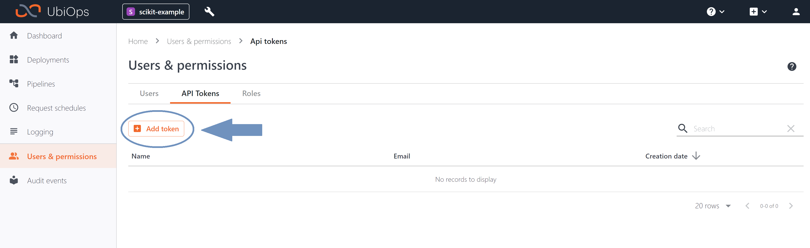

# Blobs as temporary storage

_Download link for necessary files_: [Blobs as temporary storage files](https://download-github.ubiops.com/#!/home?url=https://github.com/UbiOps/cookbook/tree/master/blobs-temporay-storage/blobs-temporay-storage)

In UbiOps the storage of deployments is not persistent. This means that even
though you can keep things in memory or save them to the local file system,
it is not guaranteed that these files persist between different deployment
requests. This is due to the way our platform scales efficiently.

In this example we will teach you how to use blobs as a means of temporary
storage. This can be useful in the following situations:

- A form of statefulness in pipelines and deployments

- Use a blob in every deployment of a pipeline without passing it through all
 of the time.

If you want to store things in a more permanent way it would be better to use
 a database for this.

## Example deployment

This example contains a deployment that uses blobs as temporary storage. The
 model adds numbers to a total which is stored as a blob. During every
 request the last blob is retrieved and used together with the model input
 to calculate the new total. This new total is then saved in blob storage.

## How does it work?

**Step 1:** Login to your UbiOps account at https://app.ubiops.com/ and create an API token with project editor
admin rights. To do so, click on *Users & permissions* in the navigation panel, and then click on *API tokens*.
Click on *create token* to create a new token.

Give your new token a name, save the token in safe place and assign the following roles to the token: project editor and blob admin.
These roles can be assigned on project level.

**Step 2:** Download the [blobs-temporay-storage](https://download-github.ubiops.com/#!/home?url=https://github.com/UbiOps/cookbook/tree/master/blobs-temporay-storage/blobs-temporay-storage) folder and open `blobs-temporay-storage.ipynb`. In the notebook you will find a space
to enter your API token and the name of your project in UbiOps. Paste the saved API token in the notebook in the indicated spot
and enter the name of the project in your UbiOps environment. This project name can be found in the top of your screen in the
WebApp. In the image in step 1 the project name is *scikit-example*.

**Step 3:** Run the Jupyter notebook `blobs-temporay-storage.ipynb` and everything will be automatically deployed to your UbiOps environment! 
Afterwards you can explore the code in the notebook or explore the application in the WebApp.
