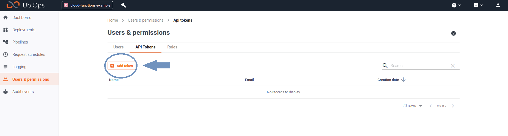

# Triggered Request from GCP Cloud Functions

_Download link for necessary files_: [Triggered request from GCP cloud functions files](https://download-github.ubiops.com/#!/home?url=https://github.com/UbiOps/cookbook/tree/master/google-cloud-functions-triggered-request/gcp-functions-recipe)

Most cloud providers offer a serverless function platform, such as Lambda in AWS, Cloud Functions in the Google Cloud Platform or Functions in Azure. 
These functions can be used to execute code based on events in services of those cloud providers, such as when new data is published in streaming solutions or when files are added to blob storage.
Using these functions and triggers, you can automatically push data to deployments or pipelines when new data or files become available by sending a request to the UbiOps API from the function.


In this example we will show you how to write a Google Cloud Function that triggers a request to a 
deployment/pipeline in the UbiOps platform.


## How does it work?

**Step 1:** Login to your UbiOps account at https://app.ubiops.com/ and create an API token with project editor
admin rights. To do so, click on *Users & permissions* in the navigation panel, and then click on *API tokens*.
Click on *create token* to create a new token.



Give your new token a name, save the token in safe place and assign the following roles to the token: project editor and blob admin.
These roles can be assigned on project level.

If you do not have or do not want to use an existing deployment or pipeline for triggering the requests from
the Cloud Functions, you can create a dummy deployment/pipeline by going through the next step. Otherwise,
if you are going to use an existing deployment or pipeline, you can skip this step.

**Step 2 (optional):** In this step we will create a dummy deployment and/or pipeline and deploy it to your UbiOps environment.
You can start by downloading the [*google-cloud-functions-triggered-request*](https://download-github.ubiops.com/#!/home?url=https://github.com/UbiOps/cookbook/tree/master/google-cloud-functions-triggered-request/gcp-functions-recipe) folder and opening *dummy_deployment_pipeline_creation.ipynb*. In the notebook you will find a space
to enter your API token and the name of your project in UbiOps. Paste the saved API token in the notebook in the indicated spot
and enter the name of the project in your UbiOps environment. This project name can be found in the top of your screen in the
WebApp. In the image in step 1 the project name is *cloud-functions-example*.

Run the Jupyter notebook *dummy_deployment_pipeline_creation.ipynb* and the deployment and/or pipeline will be automatically deployed to your UbiOps environment!
Afterwards you can explore the code in the notebook or explore the application in the WebApp.

**Step 3:** At this point in the tutorial you should have a deployment and/or pipeline to use.
We will now trigger requests to this deployment or pipeline by means of a Google Cloud Function.
Whether you are trying to trigger a deployment or pipeline request, this request can be either
a regular request or a batch request. Thus, depending on what you want to trigger,
you have in total 4 possibilities, where each of these possibilities has a different Google Cloud Function that triggers the request:

 - **Regular deployment request:** The corresponding Google Cloud Function can be retrieved
 by downloading the [*deployment-request*](https://download-github.ubiops.com/#!/home?url=https://github.com/UbiOps/cookbook/tree/master/google-cloud-functions-triggered-request/gcp-functions-recipe/functions/deployment-request) folder.

 - **Deployment batch request:** The corresponding Google Cloud Function can be retrieved
 by downloading the [*deployment-batch-request*](https://download-github.ubiops.com/#!/home?url=https://github.com/UbiOps/cookbook/tree/master/google-cloud-functions-triggered-request/gcp-functions-recipe/functions/deployment-batch-request) folder.

 - **Regular pipeline request:** The corresponding Google Cloud Function can be retrieved
 by downloading the [*pipeline-request*](https://download-github.ubiops.com/#!/home?url=https://github.com/UbiOps/cookbook/tree/master/google-cloud-functions-triggered-request/gcp-functions-recipe/functions/pipeline-request) folder.
 
 - **Pipeline batch request:** The corresponding Google Cloud Function can be retrieved
 by downloading the [*pipeline-batch-request*](https://download-github.ubiops.com/#!/home?url=https://github.com/UbiOps/cookbook/tree/master/google-cloud-functions-triggered-request/gcp-functions-recipe/functions/pipeline-batch-request) folder.

Each of the listed folders follows the same structure. It consists of:

- a *main.py* file where the actual Cloud Function code resides

- a *requirements.txt* file where the dependencies needed for running the function are listed

**Step 4:**

**WARNING**

In this cookbook, we ask you to provide the API token hardcoded in the function's main.py, for simplicity sake. We would like to warn the user that this should *absolutely never* be done in a production environment.
The API token gives access to many functionalities in your UbiOps environment and should therefore be kept safe.

##### Functions triggering deployments
For functions triggering deployment requests, make sure to change the following things in the corresponding function in main.py:

-  Fill in the Authorization API Key.  
```
configuration.api_key['Authorization'] = 'Token < YOUR PRIVATE TOKEN HERE >'
```

- Change the following keyword (named) arguments values to the values you are currently using:
Change the argument with key *project_name* to the name of the project you are using. In case you are using a version that already exists, change the argument values to those respective deployment and version names.
Otherwise, if you have just created a deployment using the provided notebook, use the name that you have given to that deployment upon creation. 

```
project_name='test-project',
deployment_name='test-deployment',
version='version'
```

##### Functions triggering pipelines
For functions triggering pipeline requests, make sure to change the following things in the corresponding function in *main.py*:

-  Fill in the Authorization API Key.  
```
configuration.api_key['Authorization'] = 'Token < YOUR PRIVATE TOKEN HERE >'
```

-   Change the following keyword (named) arguments values to the values you are currently using.
Change the argument with key *project_name* to the name of the project you are using. In case you are using a pipeline that already exists, change the argument with key *pipeline_name* to that respective pipeline name.
Otherwise, if you have just created a pipeline, use the value that you have given to that pipeline upon creation. 

```
project_name='test-project', 
pipeline_name='test-pipeline'
```

**Step 5:** In the last step we will deploy the function with a Pub/Sub trigger. In the directory 
that contains the code, run the following command:

`gcloud functions deploy ubiops_request --runtime python37 --trigger-topic YOUR_TOPIC_NAME`

You can use the following values for the --runtime flag to specify your preferred Python version:

- python37

- python38

where *YOUR_TOPIC_NAME* is the name of the Pub/Sub topic to which the function will be subscribed.

More information about the deploying process can be found [here](https://cloud.google.com/functions/docs/tutorials/pubsub#deploying_the_function).

The function can then be manually triggered via the command
`gcloud pubsub topics publish YOUR_TOPIC_NAME --message YOUR_NAME`.
Replace *YOUR_TOPIC_NAME* with the name of your Pub/Sub topic, and *YOUR_NAME* with the input that is going to be passed
 to the deployment/pipeline in the request. More information on triggering functions can be found [here](https://cloud.google.com/functions/docs/tutorials/pubsub#triggering_the_function).
