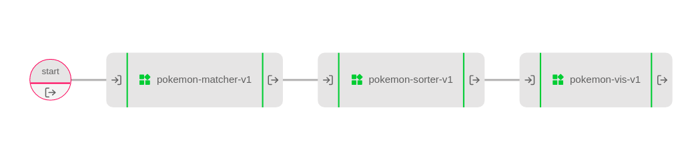

# Pokemon Pipeline

This example is based on an article previously posted on the UbiOps blog (you can read it [here](https://ubiops.com/how-to-create-a-data-pipeline-in-ubiops/)).

This pipeline takes a list of pokemon as input and outputs a visualization.

The pipeline is made up from the following deployments:

| Model | Function |
|-------|----------|
| pokemon_matcher | Match stats to Pokémon name |
| pokemon_sorter | Sort Pokémon based on the best stats |
| pokemon_vis | Visualise the results |

The pipeline looks like this:

With the following inputs and outputs

| Model | Input | Output |
|-------|----------|-----|
| pokemon_matcher | input_pokemon: array of strings | output_pokemon: file |
| pokemon_sorter | input_pokemon: file | output_pokemon: file |
| pokemon_vis | input_pokemon: file | output_pokemon: file |

## How does it work?

**Step 1:** Login to your UbiOps account at https://app.ubiops.com/ and create an API token with project editor
admin rights. To do so, click on *Users & permissions* in the navigation panel, and then click on *API tokens*.
Click on *create token* to create a new token.

Give your new token a name, save the token in safe place and assign the following roles to the token: project editor and blob admin.
These roles can be assigned on project level.

**Step 2:** Download the [pokemon-pipeline](https://github.com/UbiOps/cookbook/tree/master/docs/pokemon-pipeline/pokemon-pipeline) folder and open the notebook. In the notebook you will find a space
to enter your API token and the name of your project in UbiOps. Paste the saved API token in the notebook in the indicated spot
and enter the name of the project in your UbiOps environment. This project name can be found in the top of your screen in the
WebApp. In the image in step 1 the project name is *scikit-example*.

**Step 3:** Run the Jupyter notebook and everything will be automatically deployed to your UbiOps environment! 
Afterwards you can explore the code in the notebook or explore the application in the WebApp.
