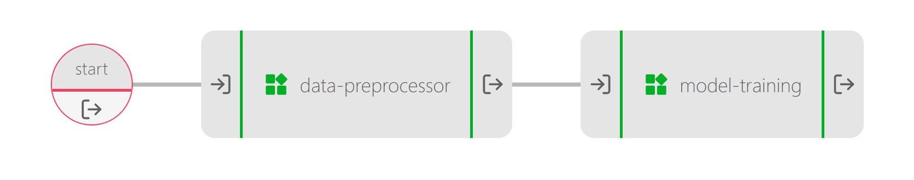
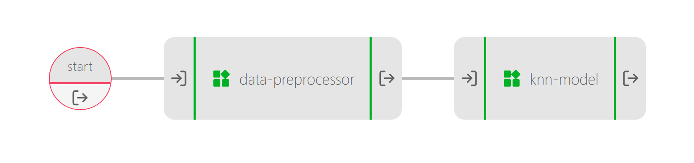

# Python Scikit learn and UbiOps

In this example we will show you the following:
- How to make a training pipeline in UbiOps which preprocesses the data and trains and tests a KNN model using scikit
- How to make a production pipeline in UbiOps which takes in new data, processes it and feeds it to a trained model for 
prediction/classification

For this example we will use a diabetes dataset from Kaggle to create a KNN classifier. This classifier predicts 
if someone will have diabetes or not. Link to original dataset: https://www.kaggle.com/uciml/pima-indians-diabetes-database
The dataset can also be found in this folder under the name 'diabetes.csv'.

## The training pipeline

The training pipeline takes the diabetes data set as input and trains a KNN classifier.
It is made up of the following deployments:

| Model | Function |
|-------|----------|
| data-preprocessor | Cleans the input data |
| model-training | Trains a KNN classifier to predict diabetes |

The pipeline looks like this:

## The production pipeline

The production pipeline takes in new data, cleans it and feeds it to a trained KNN classifier. 
It is made up of the following deployments:

| Model | Function |
|-------|----------|
| data-preprocessor | Cleans the input data |
| knn-model | Predicts diabetes instances |

The pipeline looks like this:

## How does it work?

**Step 1:** Login to your UbiOps account at https://app.ubiops.com/ and create an API token with project editor
admin rights. To do so, click on *Users & permissions* in the navigation panel, and then click on *API tokens*.
Click on *create token* to create a new token.

Give your new token a name, save the token in safe place and assign the 'project-editor' role to the token.
The role can be assigned on project level.

**Step 2:** Download the [scikit-deployment](https://download-github.ubiops.com/#!/home?url=https://github.com/UbiOps/cookbook/tree/master/docs/scikit-deployment/scikit-deployment) folder and open `scikit_deployment.ipynb`. In the notebook you will find a space
to enter your API token and the name of your project in UbiOps. Paste the saved API token in the notebook in the indicated spot
and enter the name of the project in your UbiOps environment. This project name can be found in the top of your screen in the
WebApp. In the image in step 1 the project name is *scikit-example*.

**Step 3:** Run the Jupyter notebook `scikit_deployment.ipynb` and everything
 will be automatically deployed to your UbiOps environment! 
Afterwards you can explore the code in the notebook or explore the application in the WebApp.
