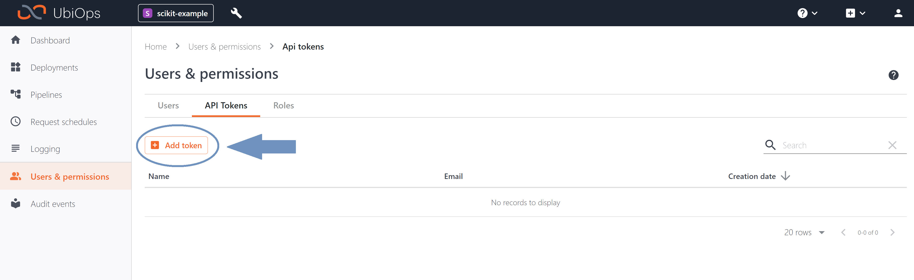

# Tensorflow Ubiops Template

_Download link for necessary files_: [Tensorflow files](https://download-github.ubiops.com/#!/home?url=https://github.com/UbiOps/cookbook/tree/master/tensorflow-example/tensorflow-ubiops-example)

In this example we will show you the following:
How to create a deployment that uses a built tensorflow model to make predictions on the fuel efficiency of late-1970s and early 1980s automobiles or MPG (miles per gallon).

## Tensorflow Deployment

The resulting deployment is made up of the following:

| Deployment | Function |
|-------|----------|
| tensorflow-deployment | A deployment that uses a trained Tensorflow model to predict MPG based on the horsepower of the automobiles |

## How does it work?

**Step 1:** Login to your UbiOps account at https://app.ubiops.com/ and create an API token with project editor
admin rights. To do so, click on *Users & permissions* in the navigation panel, and then click on *API tokens*.
Click on *create token* to create a new token.

Give your new token a name, save the token in safe place and assign the following roles to the token: project editor and blob admin.
These roles can be assigned on project level.

**Step 2:** Download the [tensorflow-ubiops-example](https://download-github.ubiops.com/#!/home?url=https://github.com/UbiOps/cookbook/tree/master/docs/tensorflow-example/tensorflow-ubiops-example) folder and open `tensorflow_template.ipynb`. In the notebook you will find a space
to enter your API token and the name of your project in UbiOps. Paste the saved API token in the notebook in the indicated spot
and enter the name of the project in your UbiOps environment. This project name can be found in the top of your screen in the
WebApp.

**Step 3:** Run the Jupyter notebook *tensorflow_template* and everything will be automatically deployed to your UbiOps environment! 
Afterwards you can explore the code in the notebook or explore the application in the WebApp.
